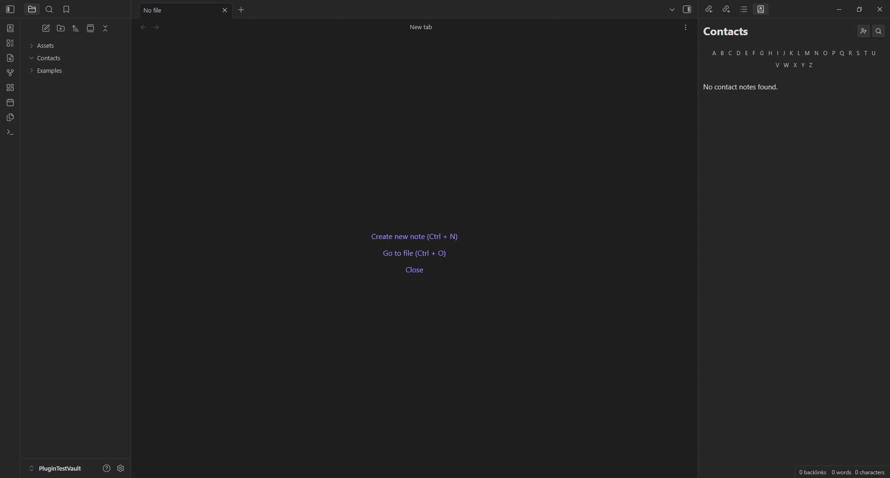
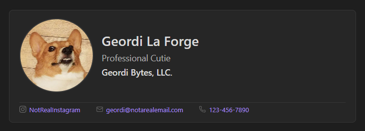
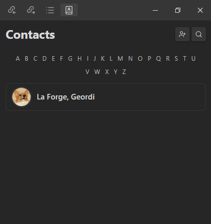
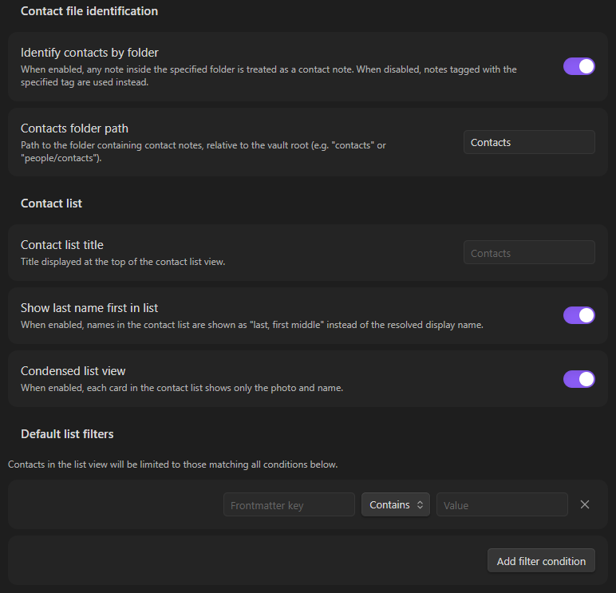

# Contact Note

An [Obsidian](https://obsidian.md/) plugin that renders visual contact cards from frontmatter in designated contact notes, with a searchable and filterable contact list view.



## Features

- Renders a contact card in reading mode for any note identified as a contact
- Sidebar contact list view with search, alphabet filter, and condensed mode
- Create new contacts from the list view with an auto-generated frontmatter template
- Enforces file naming in `First [Middle] Last` format automatically
- Supports multiple emails, phone numbers, and social media profiles per contact
- Default list filters based on any frontmatter property
- Contacts identified by folder or tag

## Installation

### Obsidian Community Plugins

1. Open Obsidian and go to **Settings → Community plugins**.
2. If restricted mode is on, click **Turn on community plugins**.
3. Click **Browse** and search for **Contact Note**.
4. Click **Install**, then **Enable**.

### Manual

1. Download `main.js`, `manifest.json`, and `styles.css` from the latest release.
2. In your vault, create the folder `.obsidian/plugins/contact-note/` if it does not already exist.
3. Copy the downloaded files into that folder.
4. Open Obsidian, go to **Settings → Community plugins**, and enable **Contact Note**.

## Usage

### Identifying contact notes

A note is treated as a contact note in one of two ways, configured in settings:

- **By folder**: any note inside a specified folder (e.g. `Contacts/`) is a contact note.
- **By tag**: any note tagged with a specified tag (e.g. `#contact`) is a contact note.

### Creating a contact

To manually create a new contact, create a new note with at least the `firstName` and `lastName` frontmatter properties in either the path of contact notes or with the contact tag specified in the plugin settings. For a list of all frontmatter properties recognized by the plugin, see [Frontmatter reference](#frontmatter-reference) below. 

To create a new contact using the plugin's template, click the **+** button in the top-right corner of the contact list view to open the new contact dialog. Enter a first and last name and click **Create**.

A new note will be created with a pre-populated frontmatter template and opened automatically.

### Contact card



In reading mode, any contact note with a valid `firstName` and `lastName` frontmatter renders a contact card in place of the frontmatter block. The card displays the contact's photo, name, title, company, email addresses, phone numbers, and social media profiles.

## Frontmatter reference

All fields are optional except `firstName` and `lastName`.

| Field | Type | Description |
|---|---|---|
| `firstName` | string | **Required.** The contact's first name. |
| `lastName` | string | **Required.** The contact's last name. |
| `middleName` | string | Middle name or initial. Used in the display name and file name. |
| `displayName` | string | Overrides the resolved display name everywhere if set. |
| `title` | string | Job title or role. |
| `company` | string | Company or organization name. |
| `email` | string or list | One or more email addresses. |
| `phone` | string or list | One or more phone numbers. |
| `photo` | string | Vault path to a photo file (e.g. `Attachments/jane.jpg`). |
| `aliases` | list | Obsidian aliases for the note. Pre-populated with `firstName` on creation. Not used directly by plugin for contact list view. |
| `socials` | list | List of social media handles. See [Socials](#socials) below. |

**Example:**

```yaml
---
firstName: Jane
middleName: A.
lastName: Smith
displayName:
company: Acme Corp
title: Engineer
email:
  - jane@example.com
phone:
  - +1 555 000 0000
photo: Attachments/jane.jpg
aliases:
  - Jane
socials:
  - github: janesmith
  - linkedin: jane-smith
---
```

### Display name resolution

The display name is resolved in the following order:

1. `displayName` if set
2. `firstName` + `middleName` + `lastName`

### File naming

The plugin automatically renames contact notes to match the format `First [Middle] Last` whenever the `firstName`, `middleName`, or `lastName` frontmatter values change. Manual renames are also corrected.

If a file with the target name already exists, the rename is skipped and a notice is shown. Add a middle name to disambiguate.

### Socials

Social profiles are defined as a list of single-key objects under the `socials` frontmatter field. The key is the platform name and the value is the handle (the `@` prefix is optional).

```yaml
socials:
  - twitter: janesmith
  - github: janesmith
  - linkedin: jane-smith
```

Supported platforms:

| Platform | Key |
|---|---|
| Bluesky | `bluesky` |
| Discord | `discord` |
| Facebook | `facebook` |
| GitHub | `github` |
| Instagram | `instagram` |
| LinkedIn | `linkedin` |
| Pinterest | `pinterest` |
| Reddit | `reddit` |
| Snapchat | `snapchat` |
| Telegram | `telegram` |
| TikTok | `tiktok` |
| Twitch | `twitch` |
| Twitter / X | `twitter` |
| YouTube | `youtube` |

Platforms not in this list will still display the handle as plain text without a link.

## Contact list view



Open the contact list view from the ribbon icon or the **Open contact list** command.

### Search

Click the **search icon** in the header to show the search bar. The search filters by first name, last name, middle name, and display name.

### Alphabet filter

Click any letter in the alphabet bar to filter contacts whose last name starts with that letter. Click the same letter again to clear the filter.

## Settings reference



### Contact File Identification

| Setting | Description | Default |
|---|---|---|
| Identify contacts by folder | When enabled, notes inside the specified folder are treated as contacts. When disabled, notes with the specified tag are used instead. | Enabled |
| Contacts folder path | Path to the contacts folder, relative to the vault root. | `Contacts` |
| Contact tag | Tag used to identify contact notes (without the `#`). Only shown when folder mode is disabled. | `contact` |

### Contact List

| Setting | Description | Default |
|---|---|---|
| Contact list title | Title shown at the top of the contact list view. | `Contacts` |
| Show last name first in list | When enabled, names in the list are shown as `Last, First Middle`. Does not affect the contact card. | Enabled |
| Condensed list view | When enabled, each card in the list shows only the photo and name. | Enabled |

### Default List Filters

Add one or more filter conditions to limit which contacts appear in the list view. All conditions must match for a contact to be shown (AND logic).

Each condition targets a frontmatter property by key and supports the following operators:

| Operator | Value required | Description |
|---|---|---|
| `Contains` | Yes | Property value contains the given string, or array includes a matching item. |
| `Is` | Yes | Property value exactly equals the given string. |
| `Exists` | No | Property is present and has a non-empty value. |
| `Is true` | No | Property value is `true` (boolean or string). |
| `Is false` | No | Property value is `false` (boolean or string). |

Filters apply to any frontmatter property, including custom fields not used by the plugin.

## Contributing

Contributions are welcome. Please open an issue to discuss significant changes before submitting a pull request.

### Prerequisites

- [Node.js](https://nodejs.org/) (v24 or later recommended)
- A local Obsidian vault for testing

### Setup

1. Clone or fork the repository into your vault's plugin folder:
   ```
   <vault>/.obsidian/plugins/contact-note/
   ```
2. Install dependencies:
   ```
   npm install
   ```
3. Start the development build (watches for changes and rebuilds automatically):
   ```
   npm run dev
   ```
4. In Obsidian, go to **Settings → Community plugins**, disable and re-enable **Contact Note** to pick up the rebuilt `main.js`.

   > Tip: The [Hot Reload](https://github.com/pjeby/hot-reload) community plugin can reload the plugin automatically on file change.

### Linting

```
npm run lint
```

ESLint 10 with [`eslint-plugin-obsidianmd`](https://github.com/obsidianmd/eslint-plugin-obsidianmd) is configured via `eslint.config.mjs`. Run lint before submitting a pull request.

### Production build

```
npm run build
```

This runs a TypeScript type-check (`tsc`) followed by an optimized esbuild bundle. The output is `main.js` in the project root. The files needed for a release are `main.js`, `manifest.json`, and `styles.css`.

### Project structure

| Path | Description |
|---|---|
| `src/main.ts` | Plugin entry point: settings, commands, event handlers |
| `src/Contact.ts` | `Contact` data model parsed from note frontmatter |
| `src/ContactCard.ts` | Builds the contact card DOM element |
| `src/ContactListView.ts` | Sidebar list view |
| `src/ContactNoteSettingTab.ts` | Settings tab UI |
| `styles.css` | All plugin styles |

## License

GNU Affero General Public License v3.0. See [LICENSE](LICENSE) for details.
