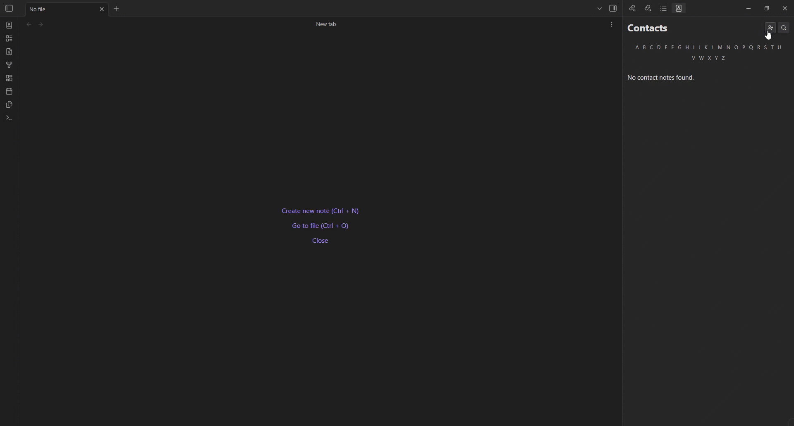
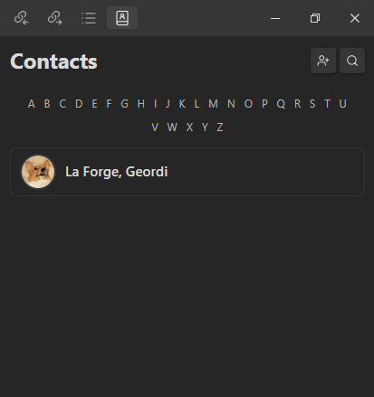

<p align="center">
  
</p>

<p align="center">
  <!--FOR THE FUTURE  -->
  
  
</p>

# Contact Note

An [Obsidian](https://obsidian.md/) plugin that turns frontmatter in notes designated as contacts into visual contact cards. Browse them with a built-in searchable, filterable view or surface them through an Obsidian Bases view that adds sorting, grouping, and extensive filtering.



## Features

- **Contact Card in Note** — Renders a contact card in reading mode for any note identified as a contact.
- **Contacts View** — A dedicated sidebar view that lists all contact notes with search, alphabet filter, display options, and a filter limiting the view to entries that match one or more frontmatter conditions.
- **Contacts in Bases** — Render the same contact cards inside an Obsidian `.base` file, with grouping, sorting, searching, and filtering driven by Bases.
- **Contact Note Template** — Create new contacts from the contacts view or a contacts base with an auto-generated frontmatter template.
- **Contact File Naming Enforcement** — Enforces file naming in `First [Middle] Last` format automatically. Duplicate names are disambiguated with a numeric suffix.
- **Multiple Values for Certain Frontmatter Properties** — Supports multiple emails, phone numbers, and social media profiles per contact.
- **Contact Note Identification** — Contacts identified by folder or tag.
- **Light and Dark Mode Support** — All plugin UI is styled for both Obsidian themes.
- **Desktop and Mobile Support** — Works in the Obsidian desktop application and the Obsidian mobile app.

## Installation

### BRAT

While Contact Note is awaiting inclusion in the Obsidian Community Plugins directory, [BRAT](https://github.com/TfTHacker/obsidian42-brat) is the recommended way to install and stay up to date. BRAT installs plugins directly from their GitHub repository and auto-updates them on each release.

1. Install **BRAT** from **Settings → Community plugins → Browse** and enable it.
2. Open the command palette (`Ctrl+P` (Windows) or `Command+P` (macOS)) and run **BRAT: Add a beta plugin for testing**.
3. Enter the repository URL: `https://github.com/Jalad25/contact-note`.
4. Choose whether to track the latest release or the latest commit, then select **Add Plugin**.
5. Open **Settings → Community plugins** and enable **Contact Note**.

To get future updates, run **BRAT: Check for updates to all beta plugins** from the command palette, or enable auto-update in BRAT's settings.

### Manual

1. Download `main.js`, `manifest.json`, and `styles.css` from the latest release.
2. In your vault, create the folder `.obsidian/plugins/contact-note/` if it does not already exist.
3. Copy the downloaded files into that folder.
4. Open Obsidian, go to **Settings → Community plugins**, and enable **Contact Note**.

### Obsidian Community Plugins

> *Coming soon! Currently pending listing in the directory.*

1. Open Obsidian and go to **Settings → Community plugins**.
2. If restricted mode is on, select **Turn on community plugins**.
3. Select **Browse** and search for **Contact Note**.
4. Select **Install**, then **Enable**.

## Usage

### Identifying Contact Notes

A note is treated as a contact note in one of two ways, configured in settings:

- **By folder**: any note inside a specified folder (e.g. `Contacts/`) is a contact note. The match is **recursive**, meaning every note in the folder *and any of its subfolders* is treated as a contact, so you can group contacts into nested folders (`Contacts/Work/`, `Contacts/Family/`, etc.) without losing them from the view.
- **By tag**: any note tagged with a specified tag (e.g. `#contact`) is a contact note.

### Creating a Contact Note

To manually create a new contact, create a new note with at least the `firstName` and `lastName` frontmatter properties in either the path of contact notes or with the contact tag specified in the plugin settings. For a list of all frontmatter properties recognized by the plugin, see [Contact Note Frontmatter Reference](#contact-note-frontmatter-reference) below. 

To create a new contact using the plugin's template, select the **user-plus** button in the contacts view header or the **New** button in a contacts base to open the new contact dialog. Enter a first and last name and select **Create**.

A new note will be created with a pre-populated frontmatter template and opened automatically.

> [!IMPORTANT]
> The plugin automatically renames contact notes to match the format `First [Middle] Last` whenever the `firstName`, `middleName`, or `lastName` frontmatter values change. Manual renames are also corrected.
>
> If a file with the target name already exists, the new contact is renamed to `First [Middle] Last 1` (incrementing the suffix until the name is unique) and a notice is shown so you know the disambiguation happened.

### Browsing Contact Notes

There are two ways to browse contact notes in the vault:

- **[Contacts view](#contacts-view)** — A dedicated sidebar leaf that lists every contact note with search, alphabet filter, and a configurable view filter.
- **[Contacts base view](#contacts-base-view)** — A custom view type for Obsidian Bases that renders the same contact cards inside a `.base` file and adds Bases' searching, grouping, sorting, and filtering on top.

Both views render the same contact cards and offer the same display options (`Condensed`, `Show contact details`, `Last name first`).

## Contact Note Frontmatter Reference

All fields are optional except `firstName` and `lastName`.

| Field | Type | Description |
|---|---|---|
| `firstName` | string | **Required.** The contact's first name. |
| `lastName` | string | **Required.** The contact's last name. |
| `middleName` | string | Middle name or initial. Used in the display name and file name. |
| `displayName` | string | Overrides the resolved display name everywhere if set. |
| `title` | string | Job title or role. |
| `company` | string | Company or organization name. |
| `email` | string or list | One or more email addresses. |
| `phone` | string or list | One or more phone numbers. |
| `photo` | string | Vault path to a photo file (e.g. `Attachments/jane.jpg`). |
| `aliases` | list | Obsidian aliases for the note. Pre-populated with `firstName` on creation. Not used directly by plugin. |
| `socials` | list | List of social media handles. See [Socials](#socials) below. |

**Example:**

```yaml
---
firstName: Geordi
middleName: Terror
lastName: La Forge
displayName: Papa
company: Geordi Bytes LLC.
title: Professional Cutie
email:
  - geordi@notarealemail.com
phone:
  - 123-456-7890
photo: Attachments/Geordi.jpg
aliases:
  - Geordi
socials:
  - github: geordiBytes
  - linkedin: geordi-bytes
---
```

### Socials

Social profiles are defined as a list of single-key objects under the `socials` frontmatter field. The key is the platform name and the value is the handle (the `@` prefix is optional).

```yaml
socials:
  - twitter: geordibytes
  - github: geordiBytes
  - linkedin: geordi-bytes
```

Supported platforms:

| Platform | Key |
|---|---|
| Bluesky | `bluesky` |
| Discord | `discord` |
| Facebook | `facebook` |
| GitHub | `github` |
| Instagram | `instagram` |
| LinkedIn | `linkedin` |
| Pinterest | `pinterest` |
| Reddit | `reddit` |
| Snapchat | `snapchat` |
| Telegram | `telegram` |
| TikTok | `tiktok` |
| Twitch | `twitch` |
| Twitter / X | `twitter` |
| YouTube | `youtube` |

Platforms not in this list will still display the handle as plain text without a link.

## Contact Card


In reading mode, any contact note with a valid `firstName` and `lastName` frontmatter renders a contact card in place of the frontmatter block. The card displays the contact's photo, name, title, company, email addresses, phone numbers, and social media profiles.

### Display Name Resolution

The display name is resolved in the following order:

1. `displayName` if set
2. `firstName` + `middleName` + `lastName`

### Photo Display

If the `photo` path is not set, the contact card displays a default person icon in its place.

## Contacts View



Open the contacts view from the **book-user** ribbon icon or the **Open contacts view** command.

### Header Buttons

| Icon | Action |
|---|---|
| **New contact** | Open the New contact dialog. |
| **Search contacts** | Toggle the search bar (see [Search](#search)). |
| **View options** (`⋮`) | Open the view options menu. |

### View Options Menu

The `⋮` menu contains options that affect the current view only and are persisted across sessions:

| Option | Description |
|---|---|
| Condensed | Show only the photo and name on each card. Hides and disables **Show contact details** while enabled. |
| Show contact details | Expand each card to include emails, phone numbers, and socials. Available only when **Condensed** is disabled. |
| Last name first | Overrides the resolved display name and displays names as `Last, First Middle`. Does not affect the contact card within a note. |
| Edit view filter… | Open the [View Filter](#view-filter) editor. |

### Search

Select the **search** icon in the header to show the search bar. The search filters by first name, last name, middle name, and display name.

### Alphabet Filter

Select any letter in the alphabet bar to filter contacts whose last name starts with that letter. Select the same letter again to clear the filter.

### View Filter

Add one or more filter conditions to limit which contacts appear in the contacts view. All conditions must match for a contact to be shown (AND logic). Open the editor from **Edit view filter…** in the view's `⋮` menu.

Each condition targets a frontmatter property by key and supports the following operators:

| Operator | Value required | Description |
|---|---|---|
| `Contains` | Yes | Property value contains the given string, or array includes a matching item. |
| `Is` | Yes | Property value exactly equals the given string. |
| `Exists` | No | Property is present and has a non-empty value. |
| `Is true` | No | Property value is `true` (boolean or string). |
| `Is false` | No | Property value is `false` (boolean or string). |

Filters apply to any frontmatter property, including custom fields not used by the plugin.

## Contacts Base View

The Contacts base view is a plugin Bases view that can be used within an Obsidian `.base` file to render the same contact cards as the Contacts view, while letting you use Bases' filtering, searching, grouping, and sorting.

### Creating a Contacts Base View

Select the **book-plus** ribbon icon, or run the **Create new base with Contacts base view** command, to generate a new `.base` file pre-configured to display contact notes through the plugin's Bases view. The base view includes a filter that limits entries to your configured contact folder or tag, sorts by last name, and is opened automatically once created.

The file name and the in-base view name come from the **Default base file and view name** setting; the file is placed in the folder set by **New base folder path**. See [Settings Reference](#settings-reference) below.

The New button opens the same New contact dialog as the Contacts view, ensuring new files land in the correct folder with the correct frontmatter shape.

The base view exposes three toggles in the Bases options panel under **Display**:

| Option | Description |
|---|---|
| Condensed | Show only the photo and name on each card. Hides and disables **Show contact details** while enabled. |
| Show contact details | Expand each card to include emails, phone numbers, and socials. Hidden while **Condensed** is enabled. |
| Last name first | Overrides the resolved display name and displays names as `Last, First Middle`. Does not affect the contact card within a note. |

### Default New Base Configuration

The **Create new base with Contacts base view** command writes a `.base` file with the following structure:

```yaml
formulas:
  isContact: 'file.inFolder("Contacts")'   # or file.hasTag("contact"), depending on your settings at the time the base was created
filters:
  and:
    - formula.isContact
views:
  - type: contact-note-list
    name: Contacts
    order:
      - note.firstName
      - note.lastName
      - note.displayName
    sort:
      - property: note.lastName
        direction: ASC
    condensed: true
    lastNameFirst: true
    showDetails: false
```

Each piece serves a purpose:

| Section | What it does |
|---|---|
| `formulas.isContact` | Captures your **Contact File Identification** setting at the moment the base was created — `file.inFolder("…")` if you were on folder mode, `file.hasTag("…")` if you were on tag mode. The expression is written into the file as a literal string and **does not** track future changes to the setting. If you switch identification mode or rename your contacts folder/tag, edit the formula in the base by hand or run **Create new base with Contacts base view** again to generate a fresh file. |
| `filters.and` | Applies `isContact` as a filter to all views in the base. |
| `views[].type: contact-note-list` | Tells Bases to render this view through Contact Note's renderer. Without this, Bases falls back to its built-in table or card view and the plugin's contact cards are not used. |
| `views[].name` | The label shown in the base's view tabs. |
| `views[].order` | The properties shown in the Bases property picker. The plugin ignores this for rendering, but Bases uses it for grouping and search. |
| `views[].sort` | The default sort order for the base view. |
| `views[].condensed` / `lastNameFirst` / `showDetails` | The starting values for the **Display** toggles described above. |

### Editing a Base Freely

A `.base` file is plain YAML, and the plugin treats whatever Bases passes it as authoritative. You're free to edit any of the sections above, add views, change sorts, add groupings, and so on.

A few things to know before you edit:

- **`type: contact-note-list` is required.** A view without this exact value renders through Bases' built-in views, not Contact Note's. The plugin's three Display toggles, the New button, and the contact card layout only exist on views with this type.
- **`formulas.isContact` is a snapshot, not a live link.** It's written into the file once when the base is created and is never touched again by the plugin. You can edit it freely to broaden or narrow the filter, but if you later change the **Identify contacts by folder** setting (or rename the folder/tag) the formula will *not* update on its own. You'll need to edit it by hand or recreate the base.
- **Removing `formulas.isContact` or `filters.and` removes the contact-note guarantee.** If the filter no longer pins the base to your contacts folder or tag, non-contact notes can leak into the view, and the cards will render with whatever frontmatter happens to be present (often empty placeholders).
- **`sort` can be replaced freely.** Sort by company, by `displayName`, by any frontmatter property — Bases applies the sort before handing entries to the view.
- **Removing `order` (properties) is harmless visually but changes how Bases' searches.** The plugin renders cards regardless of the `order` list, but Bases' built-in search bar only matches against properties that are listed there. Keep `note.firstName`, `note.middleName`, `note.lastName`, and `note.displayName` in `order` to keep search working the same way it does in the Contacts view.
- **You can have multiple views in one base.** Add another entry under `views:` (for example a Bases table view) to switch between contact cards and a tabular layout in the same file. Each view stores its own sort, group, properties, and filter. However, creating a new Contacts base view within an existing base without the plugin's commands will not apply the default `sort`, `order` (properties), `formulas` (if in base not created by plugin), or `filters` (if in base not created by plugin).
- **Search and the contact card body don't always agree.** Bases' search bar matches against the properties in `order`, not the rendered card. To add more properties to search off of, select them in the properties dropdown or add them to the `order` list.

### Creating a Base Without the Plugin

You can also create a `.base` file the normal Obsidian way (right-click or long-press on mobile in the file tree → **New base**, or use the built-in command). When you do, none of the plugin's defaults are present. The new base ships with Bases' generic table view, no filter, no sort, and no display toggles. Specifically you will be missing:

- The `isContact` formula and the filter that limits entries to your configured contact folder or tag. Every note in the vault is shown until you add one.
- The default sort by last name (entries are listed in Bases' default order, usually file name).
- The `order` list that wires Bases' search to first/middle/last/display name fields.
- The `condensed: true` / `lastNameFirst: true` / `showDetails: false` defaults for the contact card view.
- The plugin's contact card view itself. Until you change `type:` to `contact-note-list`, the file renders with Bases' generic table or card view.

To convert a hand-built base view into a contacts base view, set the view type to `contact-note-list`, add `formulas.isContact` and `filters.and` as shown above, and copy whatever subset of `order` / `sort` / display toggles you want. The **Create new base with Contacts base view** command exists precisely so you don't have to do this by hand.

## Settings Reference

### Contact File Identification

| Setting | Description | Default |
|---|---|---|
| Identify contacts by folder | When enabled, notes inside the specified folder are treated as contacts. When disabled, notes with the specified tag are used instead. | Enabled |
| Contacts folder path | Path to the contacts folder, relative to the vault root. The match is recursive: every note in this folder and in any of its subfolders is treated as a contact. | `Contacts` |
| Contact tag | Tag used to identify contact notes (without the `#`). Only shown when folder mode is disabled. | `contact` |

### Contacts View

| Setting | Description | Default |
|---|---|---|
| View name | Name shown at the top of the contacts view. | `Contacts` |

> Display options (`Condensed`, `Show contact details`, `Last name first`) and the view filter editor are managed through the view's `⋮` menu. See [View Options Menu](#view-options-menu).

### Contacts Base View

| Setting | Description | Default |
|---|---|---|
| Default base file and view name | Name written into new contacts bases created by the plugin. Used both as the file name and as the view's display name inside the base. | `Contacts` |
| New base folder path | Folder where new contacts bases are created, relative to the vault root. Leave empty to place them in the vault root. | *(empty)* |

## Contributing

Contributions of all kinds are welcome!

See [CONTRIBUTING.md](CONTRIBUTING.md) for full guidelines.

## License

GNU Affero General Public License v3.0. See [LICENSE](LICENSE) for details.
